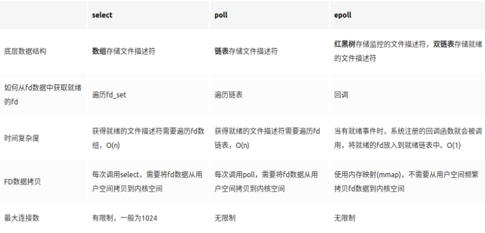

## io 复用

### 1. 基本概念

#### 1.1 什么是 io 复用

IO 复用（Input/Output Multiplexing，也做 io 多路复用）是一种可以让单个线程处理多个 IO 操作的技术。在 IO 复用模型中，线程可以同时等待多个 IO 操作（例如，多个 socket 连接），当任何一个 IO 操作完成时，线程就可以处理这个操作。

IO 复用的主要优点是可以提高线程的利用率，因为线程不需要为每个 IO 操作单独等待，而是可以在等待一个 IO 操作的同时，处理其他的 IO 操作。这对于需要处理大量并发连接的网络服务器来说，是非常重要的。

在 Linux 中，常见的 IO 复用技术有 select、poll 和 epoll。在 Windows 中，常见的 IO 复用技术有 select 和 IOCP（Input/Output Completion Port）。在 Java 中，NIO（Non-blocking IO）库提供了 IO 复用的支持。

#### 1.2 io 操作是什么？

IO 操作，全称为输入/输出操作，是计算机系统中数据在内部（如 CPU、内存）和外部设备（如硬盘、网络接口、打印机）之间传输的过程。

linux 一个突出的设计理念在于，将一切外部设备看成一个文件来操作。任何东西都挂在文件系统之上，即使它们不是文件，也以文件的形式来呈现。这些一切外部设部都享有与内部文件一样的接口。

所以`串口`，`内存`，`usb`，`进程信息`，`网卡`，`网络通讯socket`等等一切外部设备的数据输入输入就是 io 的过程。

一般来说，在网络编程的语境下，io 多路复用是指单个线程中同时处理多个 socket 连接的技术。这种技术可以提高线程的利用率，因为线程在等待一个 IO 操作完成的同时，可以处理其他的 IO 操作。

IO 过程包括两个阶段:(1)内核从 IO 设备读写数据和(2)进程从内核复制数据。

#### 1.3 linux 下如何实现 io 复用？

在 Linux 系统中，实现 IO 复用主要有以下几种方式：

`select`：select 是最早的 IO 复用解决方案，它可以同时监控多个文件描述符（例如 socket）。当其中任何一个文件描述符准备好读、写或异常时，select 就会返回。select 的主要缺点是它支持的文件描述符数量有限（通常最多 1024 个），并且效率随着文件描述符数量的增加而降低。

`poll`：poll 和 select 类似，但它没有最大文件描述符数量的限制。然而，poll 的效率仍然随着文件描述符数量的增加而降低。

`epoll`：epoll 是 Linux 特有的 IO 复用解决方案，它没有最大文件描述符数量的限制，而且效率不会随着文件描述符数量的增加而降低。epoll 使用一种称为事件驱动的方式，只关注活跃的文件描述符，因此比 select 和 poll 更高效。

### 2. io 复用技术

`select`、`poll`和`epoll`是 Linux 系统中用于 IO 多路复用的三种机制。它们允许程序监视多个文件描述符（FD），以便知道哪个或哪些文件描述符可以进行非阻塞 IO 操作。以下是它们的主要区别：



#### 2.1 select

- **工作方式**：`select`允许应用程序监视一组文件描述符，以了解是否有数据可读、可写或是否有异常条件待处理。
- **限制**：`select`有一个固定的大小限制（通常由 FD_SETSIZE 宏定义，标准值为 1024），这意味着它一次只能监视 1024 个文件描述符。
- **性能**：当文件描述符集合较小时，性能尚可。但随着监视的文件描述符数量增加，其性能会线性下降，因为`select`需要在用户空间和内核空间之间复制整个文件描述符集。

- **_代码_**

  ```cpp
  int select (int n, fd_set *readfds, fd_set *writefds, fd_set *exceptfds, struct timeval *timeout);
  ```

  ​ `select`函数监视的文件描述符分 3 类，分别是`writefds`、`readfds`、和`exceptfds`。调用后`select`函数会阻塞，直到有描述副就绪（有数据 可读、可写、或者有`except`），或者超时（`timeout`指定等待时间，如果立即返回设为`null`即可），函数返回。当`select`函数返回后，可以 通过遍历`fd_set`，来找到就绪的描述符。

- **_特点_**

  ​ `select`目前几乎在所有的平台上支持，其良好跨平台支持也是它的一个优点。select 的一个缺点在于单个进程能够监视的文件描述符的数量存在最大限制，在`Linux`上一般为 1024，可以通过修改宏定义甚至重新编译内核的方式提升这一限制，但 是这样也会造成效率的降低。

- **_不足_**
  - 每次调用`select`，都需要把`fd`集合从用户态拷贝到内核态，这个开销在 fd 很多时会很大
  - 同时每次调用`select`都需要在内核遍历传递进来的所有`fd`，这个开销在 fd 很多时也很大
  - `select`支持的文件描述符数量太小了，默认是 1024

#### 2.2 poll

- **工作方式**：`poll`与`select`类似，也是监视一组文件描述符的状态变化。但它没有`select`的数量限制，因为它使用动态分配的结构体数组而不是固定大小的位图。
- **限制**：尽管`poll`没有文件描述符数量的硬性限制，但随着监视的文件描述符数量增加，其性能也会受到影响，因为它需要遍历整个文件描述符列表来检查状态。
- **性能**：`poll`的性能优于`select`，尤其是在处理大量文件描述符时。

  ​ 不同于`select`使用三个`fd_set`，`poll`使用一个`pollfd`的指针实现。而`pollfd`结构包含了要监视的`event`和发生的`event`，不再使用`select`“参数-值”传递的方式。同时，pollfd 并没有最大数量限制。

  ```cpp
  int poll (struct pollfd *fds, unsigned int nfds, int timeout);

  struct pollfd {
      int fd; /* file descriptor */
      short events; /* requested events to watch */
      short revents; /* returned events witnessed */
  };
  ```

- **_特点_**

  ​ `poll`和`select`类似，但是没有最大链接数的限制，fds 是一个指向 struct pollfd 类型数组的首地址。这个数组的大小是由调用者决定的，不受静态限制。

- **_不足_**

  - `poll`没有本质上改变`select`的方法，只是没有`fd_maxsize`的限制。`select`和`epoll`的不足之处还是类似的

#### 2.3 epoll

- **工作方式**：`epoll`是 Linux 特有的，相比于`select`和`poll`，`epoll`提供了更高的性能和更大的可扩展性。它使用一种事件通知机制，只返回活跃的文件描述符，避免了遍历整个文件描述符集。
- **限制**：`epoll`的接口和行为与`select`和`poll`有所不同，需要更改代码来使用。它在早期的 Linux 内核版本中不可用。
- **性能**：`epoll`的性能不会随着监视的文件描述符数量增加而显著下降。它特别适用于高并发、大量连接的场景。

  ```c++
  int epoll_create(int size);
  int epoll_ctl(int epfd, int op, int fd, struct epoll_event *event);
  int epoll_wait(int epfd, struct epoll_event * events, int maxevents, int timeout);

  struct epoll_event {
    __uint32_t events;  /* Epoll events */
    epoll_data_t data;  /* User data variable */
  };

  /*
  	events可以是以下几个宏的集合：
  	EPOLLIN ：表示对应的文件描述符可以读（包括对端SOCKET正常关闭）；
  	EPOLLOUT：表示对应的文件描述符可以写；
  	EPOLLPRI：表示对应的文件描述符有紧急的数据可读（这里应该表示有带外数据到来）；
  	EPOLLERR：表示对应的文件描述符发生错误；
  	EPOLLHUP：表示对应的文件描述符被挂断；
  	EPOLLET： 将EPOLL设为边缘触发(Edge Triggered)模式，这是相对于水平触发(Level Triggered)来说的。
  	EPOLLONESHOT：只监听一次事件，当监听完这次事件之后，如果还需要继续监听这个socket的话，需要再次把这个socket加入到EPOLL队列里
  */
  ```

* LT 模式，EPOLLIN 触发条件
  - 处于可读状态：
    - 1. socket 内核接收缓冲区中字节数大于或等于其低水位标记 SO_RCVLOWAT；
    - 2. 监听 socket 上有新的连接请求；
    - 3. 通信对方关闭连接，读操作返回 0；
    - 4. socket 异常/错误未处理
  - 从不可读状态变为可读状态
* LT 模式，EPOLLOUT 触发条件
  - 处于可写状态：
    - 1. socket 内核发送缓冲区中字节数大于等于其低水位标记 SO_SNDLOWAT；
    - 2. socket 写操作被关闭，写操作触发 SIGPIPE；
    - 3. socket 上有未处理错误；
    - 4. socket 使用非阻塞 connect 连接成功或失败之后
  - 从不可写状态变为可写状态
* ET 模式，EPOLLIN 触发条件
  - 从不可读状态变为可读状态
  - 内核接收到新发来的数据
* ET 模式，EPOLLOUT 触发条件
  - 从不可写状态变为可写状态
  - 只要同时注册了 EPOLLIN 和 EPOLLOUT 事件，当对端发数据来的时候，如果此时是可写状态，epoll 会同时触发 EPOLLIN 和 EPOLLOUT 事件
  - 接受连接后，只要注册了 EPOLLOUT 事件，那么就会马上触发 EPOLLOUT 事件

### 99. quiz

#### 1. select，poll 和 epoll 的区别及应用场景

- 对于 select 和 poll 来说，所有文件描述符都是在用户态被加入其文件描述符集合的，每次调用都需要将整个集合拷贝到内核态；epoll 则将整个文件描述符集合维护在内核态，**每次添加文件描述符的时候都需要执行一个系统调用**。系统调用的开销是很大的，而且在有**很多短期活跃连接**的情况下，epoll 可能会慢于 select 和 poll 由于这些大量的系统调用开销
- `select`和`poll`都只能工作在相对低效的 LT 模式下，而`epoll`同时支持 LT 和 ET 模式
- **综上，当监测的 fd 数量较小，且各个 fd 都很活跃的情况下，建议使用`select`和`poll`；当监听的 fd 数量较多，且单位时间仅部分 fd 活跃的情况下，使用 epoll 会明显提升性能。要求实时性的场景也可以使用`select`，因为`select`的`timeout`参数精度是微妙级，而其他两个是毫秒**
- **需要监控的描述符状态变化多，而且都是非常短暂的，也没有必要使用 `epoll`**。因为 `epoll` 中的所有描述符都存储在内核中，造成每次需要对描述符的状态改变都需要通过 `epoll_ctl`进行系统调用，**频繁系统调用降低效率**。并且 `epoll` 的描述符存储在内核，不容易调试

#### 2. LT（电平触发）和 ET（边缘触发）的差别

- LT（电平触发）：类似`select`，LT 会去遍历在 epoll 事件表中每个文件描述符，来观察是否有我们感兴趣的事件发生，如果有（触发了该文件描述符上的回调函数），`epoll_wait`就会以非阻塞的方式返回。**若该 epoll 事件没有被处理完**（没有返回`EWOULDBLOCK`），该事件还会被后续的`epoll_wait`再次触发
- ET（边缘触发）：ET 在发现有我们感兴趣的事件发生后，立即返回，并且`sleep`这一事件的`epoll_wait`，不管该事件有没有结束
- **在使用 ET 模式时，必须要保证该文件描述符是非阻塞的**（确保在没有数据可读时，该文件描述符不会一直阻塞，以避免由于一个文件句柄的阻塞读/阻塞写操作把处理多个文件描述符的任务饿死）；**并且每次调用`read`和`write`的时候都必须等到它们返回`EWOULDBLOCK`**（**确保所有数据都已读完或写完，因为若没有新事件到来，将不再通知**）

### 附录

#### (1) Linux 的 I/O 模型介绍以及同步异步阻塞非阻塞的区别(超级重要)

https://blog.csdn.net/sqsltr/article/details/92762279

https://www.cnblogs.com/euphie/p/6376508.html

#### (3) EPOLL 的介绍和了解

https://zhuanlan.zhihu.com/p/56486633

https://www.jianshu.com/p/397449cadc9a

https://blog.csdn.net/davidsguo008/article/details/73556811

Epoll 是 Linux 进行 IO 多路复用的一种方式,用于在一个线程里监听多个 IO 源,在 IO 源可用的时候返回并进行操作.它的特点是基于事件驱动,性能很高.

epoll 将文件描述符拷贝到内核空间后使用红黑树进行维护,同时向内核注册每个文件描述符的回调函数,当某个文件描述符可读可写的时候,将这个文件描述符加入到就绪链表里,并唤起进程,返回就绪链表到用户空间,由用户程序进行处理.

Epoll 有三个系统调用:epoll_create(),epoll_ctl()和 epoll_wait().

- eoll_create()函数在内核中初始化一个 eventpoll 对象,同时初始化红黑树和就绪链表.

- epoll_ctl()用来对监听的文件描述符进行管理.将文件描述符插入红黑树,或者从红黑树中删除,这个过程的时间复杂度是 log(N).同时向内核注册文件描述符的回调函数.

- epoll_wait()会将进程放到 eventpoll 的等待队列中,将进程阻塞,当某个文件描述符 IO 可用时,内核通过回调函数将该文件描述符放到就绪链表里,epoll_wait()会将就绪链表里的文件描述符返回到用户空间.

#### (4) IO 复用的三种方法(select,poll,epoll)深入理解,包括三者区别,内部原理实现?

(3)epoll 将文件描述符拷贝到内核空间后使用红黑树进行维护,同时向内核注册每个文件描述符的回调函数,当某个文件描述符可读可写的时候,将这个文件描述符加入到就绪链表里,并唤起进程,返回就绪链表到用户空间.

详见 https://www.cnblogs.com/Anker/p/3265058.html

#### (5) Epoll 的 ET 模式和 LT 模式(ET 的非阻塞)

- ET 是边缘触发模式,在这种模式下,只有当描述符从未就绪变成就绪时,内核才会通过 epoll 进行通知.然后直到下一次变成就绪之前,不会再次重复通知.也就是说,如果一次就绪通知之后不对这个描述符进行 IO 操作导致它变成未就绪,内核也不会再次发送就绪通知.优点就是只通知一次,减少内核资源浪费,效率高.缺点就是不能保证数据的完整,有些数据来不及读可能就会无法取出.
- LT 是水平触发模式,在这个模式下,如果文件描述符 IO 就绪,内核就会进行通知,如果不对它进行 IO 操作,只要还有未操作的数据,内核都会一直进行通知.优点就是可以确保数据可以完整输出.缺点就是由于内核会一直通知,会不停从内核空间切换到用户空间,资源浪费严重.

### 参考

[一文搞懂 select、poll 和 epoll 区别](https://zhuanlan.zhihu.com/p/272891398)

[Linux IO 模式及 select、poll、epoll 详解](https://segmentfault.com/a/1190000003063859)

[select/poll/epoll 的区别](https://www.cnblogs.com/aspirant/p/9166944.html)
